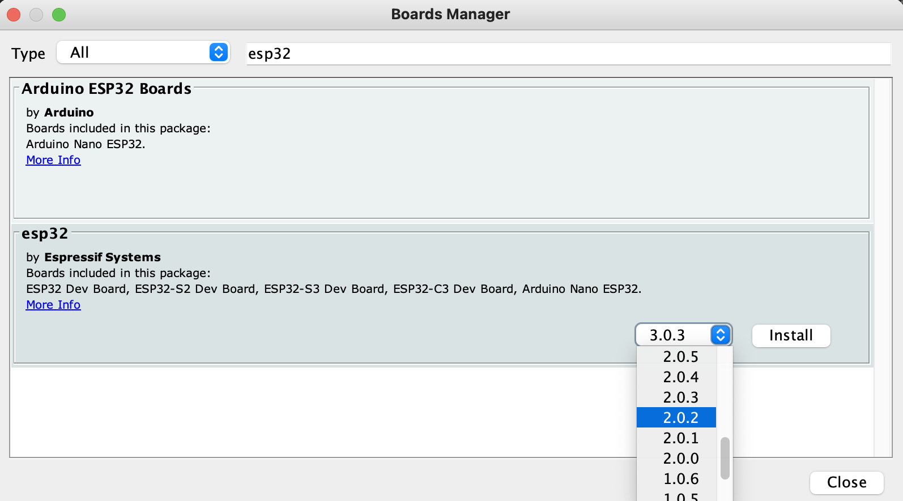

# TODO

## Development

### Midi input for the esp32

Once you flash the board, it's convenient to be be able to send the board midi signals and also read debug data that the board is sending back. To do that, use the serialmidi.py file which is a copy of the serialmidi project that just prints incoming messages rather than interpreting them as midi. Run it like this:

```
 python3 serialmidi.py --serial_name=/dev/cu.usbserial-0001 --midi_in_name="Circuit"  --midi_out_name="IAC Driver Bus 1"  --debug
```

You need to also "activate the serial bus" as a midi device in Audio Midi Setup to get this to work. Also you'll need to use the right midi_in_name, in my case I am using a novation circuit controller which appears as "Circuit".

## Initial setup

Install Arduino 1.8.13: https://www.arduino.cc/en/software/OldSoftwareReleases

Clone https://github.com/jordanlewis/ml_synth_organ_example into ~/Documents/Arduino:
```
mkdir ~/Documents/Arduino/ml_synth_organ_example && git clone git@github.com:jordanlewis/ml_synth_organ_example.git ~/Documents/Arduino/ml_synth_organ_example
```

Install various arduino libraries:
```
brew install arduino-cli
arduino-cli lib install 'Adafruit NeoPixel' arduino-timer ArduinoBLE BLE-MIDI 'MIDI Library' NimBLE-Arduino 'USB Host Shield Library 2.0'
```

You should now have libraries installed:
```
% ls -l ~/Documents/Arduino/libraries
total 8
drwxr-xr-x    7 dleibovic  staff   224 Feb 22  2014 Adafruit_NeoPixel
drwxr-xr-x   11 dleibovic  staff   352 Aug  7 21:17 ArduinoBLE
drwxr-xr-x   10 dleibovic  staff   320 Aug  7 21:17 BLE-MIDI
drwxr-xr-x    7 dleibovic  staff   224 Feb 22  2014 MIDI
drwxr-xr-x   17 dleibovic  staff   544 Aug  7 21:17 MIDI_Library
drwxr-xr-x    9 dleibovic  staff   288 Aug  7 21:17 NimBLE-Arduino
drwxr-xr-x  108 dleibovic  staff  3456 Aug  7 21:17 USB_Host_Shield_Library_2.0
drwxr-xr-x   11 dleibovic  staff   352 Aug  7 21:17 arduino-timer
drwxr-xr-x    4 dleibovic  staff   128 Feb 22  2014 flash_color
drwxr-xr-x    5 dleibovic  staff   160 Feb 22  2014 midilooper_bus
drwxr-xr-x    5 dleibovic  staff   160 Feb 22  2014 midilooper_channel
drwxr-xr-x    4 dleibovic  staff   128 Feb 22  2014 midilooper_instruction
drwxr-xr-x    5 dleibovic  staff   160 Feb 22  2014 midilooper_loop
-rw-r--r--    1 dleibovic  staff    83 Feb 22  2014 readme.txt

% arduino-cli lib list
Name                        Installed Available Location Description
Adafruit_NeoPixel                     -         user     -
arduino-timer               3.0.1     -         user     -
ArduinoBLE                  1.3.7     -         user     -
BLE-MIDI                    2.2       -         user     -
flash_color                           -         user     -
MIDI                                  -         user     -
MIDI Library                5.0.2     -         user     -
midilooper_bus                        -         user     -
midilooper_channel                    -         user     -
midilooper_instruction                -         user     -
midilooper_loop                       -         user     -
NimBLE-Arduino              1.4.2     -         user     -
USB Host Shield Library 2.0 1.7.0     -         user     -
```

clone this into the libraries directory https://github.com/marcel-licence/ML_SynthTools?tab=readme-ov-file :
```
mkdir ~/Documents/arduino/libraries/ML_SynthTools && git clone git@github.com:marcel-licence/ML_SynthTools.git ~/Documents/arduino/libraries/ML_SynthTools
```

Apply the following diff: https://gist.github.com/dasl-/fcd9812ba9954f5f6cecb735b31631d9
```
cd ~/Documents/arduino/libraries/ML_SynthTools && git apply <(curl -s https://gist.githubusercontent.com/dasl-/fcd9812ba9954f5f6cecb735b31631d9/raw/52821e5d5554a5e07c2c5439d5c5c7c018b4d87c/diff.diff)
```

Install esp32 boards in Arduino, version 2.0.2:
1. Tools > Board > Boards Manager
1. Search `esp32`
1. Select version 2.0.2 and Install 
1. Tools > Board > ESP32 Arduino > ESP32 Dev Module


[Workaround](https://github.com/espressif/arduino-esp32/issues/4717#issuecomment-1070801525) for error: `exec: "python": executable file not found in $PATH`:
```
sed -i -e 's/=python /=python3 /g' ~/Library/Arduino15/packages/esp32/hardware/esp32/*/platform.txt
```

Install python libraries for `serialmidi.py` (see above):
```
sudo python3 -m pip install --upgrade --break-system-packages python-rtmidi pyserial
```

Clone https://github.com/jordanlewis/esp32_fm_synth into into ~/Documents/Arduino:
```
mkdir ~/Documents/Arduino/esp32_fm_synth && git clone git@github.com:jordanlewis/esp32_fm_synth.git ~/Documents/Arduino/esp32_fm_synth
```

Open `~/Documents/Arduino/esp32_fm_synth/esp32_fm_synth.ino` in the Arduino IDE and edit as desired.

## GPIO Pins
### good pins:
LEDs work with sound on these pins: 21, 22, 23, 18, 5

### bad pins:
0, 19
