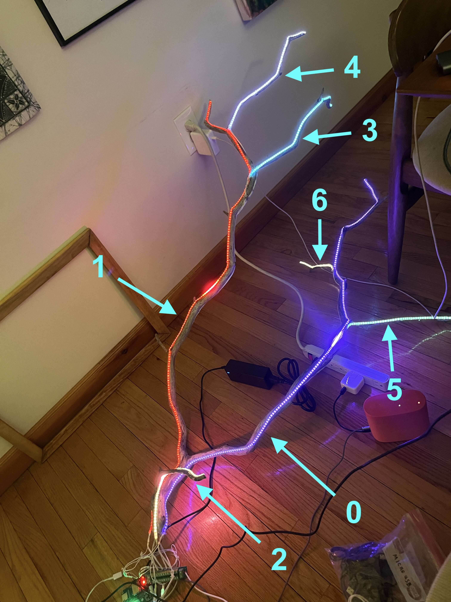

# Roots

## Initial setup

Install [Arduino 1.8.13](https://www.arduino.cc/en/software/OldSoftwareReleases).

Clone our [fork of ml_synth_organ_example](https://github.com/jordanlewis/ml_synth_organ_example) into `~/Documents/Arduino`:
```
mkdir ~/Documents/Arduino/ml_synth_organ_example && git clone git@github.com:jordanlewis/ml_synth_organ_example.git ~/Documents/Arduino/ml_synth_organ_example
```

Install various arduino libraries. It might be possible to upgrade these libraries, but these are the known working versions that we use:
```
brew install arduino-cli
arduino-cli lib install 'Adafruit NeoPixel'@1.12.3 arduino-timer@3.0.1 ArduinoBLE@1.3.7 BLE-MIDI@2.2 FastLED@3.7.8 'MIDI Library'@5.0.2 NimBLE-Arduino@1.4.2 'USB Host Shield Library 2.0'@1.7.0
```

In case any of these libraries disappear in the future, see also `libraries.zip` which is an archive of these libraries at the above noted versions.

Clone our [fork of ML_SynthTools](https://github.com/dasl-/ML_SynthTools) into the libraries directory:
```
mkdir ~/Documents/arduino/libraries/ML_SynthTools && git clone git@github.com:dasl-/ML_SynthTools.git ~/Documents/arduino/libraries/ML_SynthTools
```

Install esp32 boards in Arduino, version 2.0.2:
1. Tools > Board > Boards Manager
1. Search `esp32`
1. Select version 2.0.2 and Install 
1. Tools > Board > ESP32 Arduino > ESP32 Dev Module

[Workaround](https://github.com/espressif/arduino-esp32/issues/4717#issuecomment-1070801525) for error: `exec: "python": executable file not found in $PATH`:
```
sed -i -e 's/=python /=python3 /g' ~/Library/Arduino15/packages/esp32/hardware/esp32/*/platform.txt
```

Install python libraries for `serialmidi.py` (see above):
```
sudo python3 -m pip install --upgrade --break-system-packages python-rtmidi pyserial
```

Clone our [fork of esp32_fm_synth](https://github.com/jordanlewis/esp32_fm_synth) into `~/Documents/Arduino`:
```
mkdir ~/Documents/Arduino/esp32_fm_synth && git clone git@github.com:jordanlewis/esp32_fm_synth.git ~/Documents/Arduino/esp32_fm_synth
```

Open [`~/Documents/Arduino/esp32_fm_synth/esp32_fm_synth.ino`](https://github.com/jordanlewis/esp32_fm_synth/blob/main/esp32_fm_synth.ino) in the Arduino IDE and edit as desired.

## GPIO Pins
* good pins -- LEDs work with sound on these pins: 21, 22, 23, 18, 5
* bad pins -- these are not compatible with sound: 0, 19

## LED indexes

In [the code](https://github.com/jordanlewis/esp32_fm_synth/blob/main/esp32_fm_synth.ino), each branch's LED strip has an index that we use to access that particular LED strip. The indexes are numbered 0 - 6. Here is an image demonstrating which index corresponds to which branch:



## Midi input for the esp32

Once you flash the board, it's convenient to be be able to send the board midi signals and also read debug data that the board is sending back. To do that, use the serialmidi.py file which is a copy of the serialmidi project that just prints incoming messages rather than interpreting them as midi. Run it like this:

```
 python3 serialmidi.py --serial_name=/dev/cu.usbserial-0001 --midi_in_name="Circuit"  --midi_out_name="IAC Driver Bus 1"  --debug
```

You need to also "activate the serial bus" as a midi device in Audio Midi Setup to get this to work. Also you'll need to use the right midi_in_name, in my case I am using a novation circuit controller which appears as "Circuit".

## FastLED LED driver
* I tried using `#define FASTLED_RMT_BUILTIN_DRIVER 1` just before the `#include <FastLED.h>` line. It crashed
* I tried using `#define FASTLED_ESP32_I2S true` juts before the `#include <FastLED.h>` line. It also crashed
* Maybe it's because we're using a very outdated arduino  ESP32 board library in order to be compatible with the ML Synth project? See: https://github.com/FastLED/FastLED/issues/1642#issuecomment-2387903370
* We can try these settings again after ML Synth is compatible with a more recent ESP32 board library. See: https://github.com/marcel-licence/ML_SynthTools/issues/49
* So I'm using whichever driver is the default. It takes 6-7ms to send the signal to a single strip of 200 LEDs.
* If I use 2 GPIO pins to drive 2 separate strips, each of which is 200 LEDs, it still takes 6-7ms to send the signal. So it works in parallel when using multiple pins.
